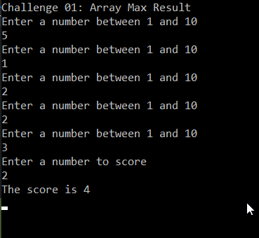
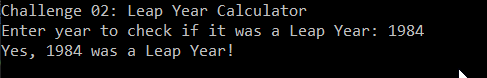
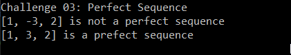
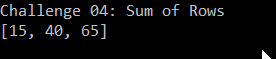

# PreWorkChallenges
**Challenge 01**
  - Array Max result
    - This method takes in an array and a number. The method then searchs the array to see how often that number occurs, 
    returning a score based the number times the number it appears in the array

    

**Challenge 02**
  - Leap Year Calculator
    - This method intakes a year from the user determines whether or not it is was a Leap Year, returning an affirmative or negative response

  

**Challenge 03**
  - Perfect Sequence
    - this method intakes an array and calculates whether or not is a perfect sequence, containing no negative numbers and having the sum of elements
    equal to the product of elements

    

**Challenge 04**
  - Sum of Rows
    - given a matrix of integers, this method returns a one dimensional array with each element being the sum of a corresponding row of numbers 
    from the matrix

    